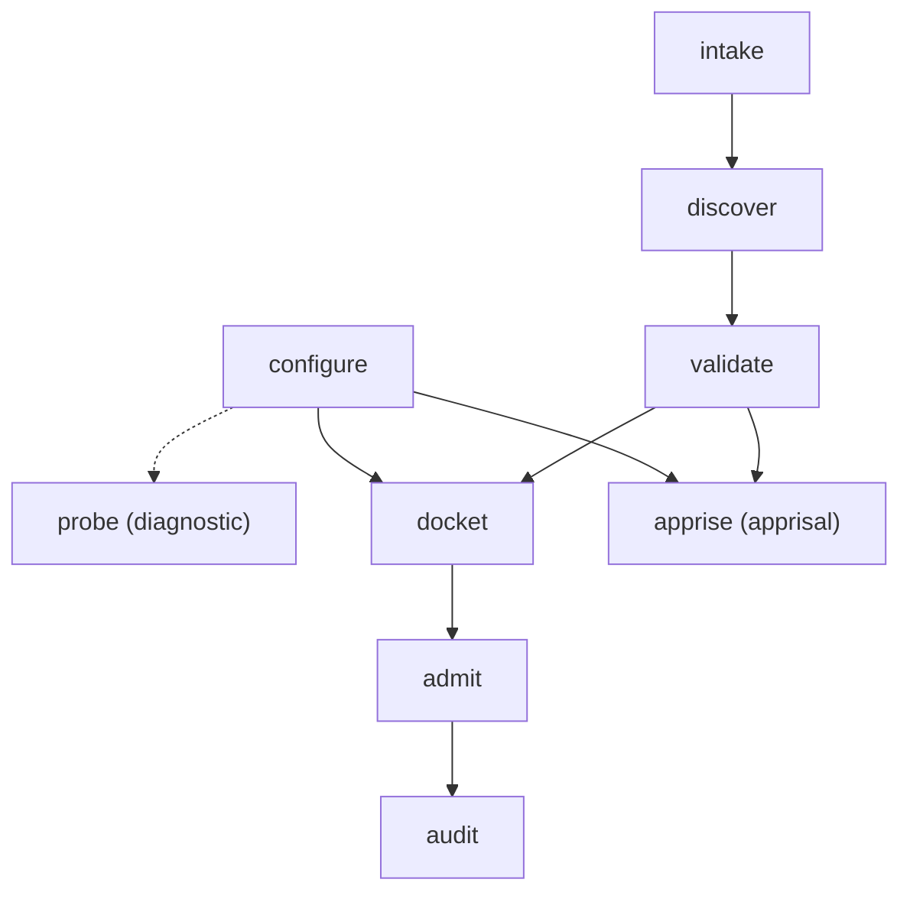

# Architecture & The Caseload Pipeline

**Status:** Authoritative Architectural Standard  
**Domain Concept:** The Caseload DAG Execution Model

---

## 1. Overview & Motivation

Canon Clerk is an automated review gate that enforces declarative engineering rule packs (*canons*) without incurring the prohibitive latency and cost of evaluating every rule with deep reasoning models on every commit.

Evaluation is orchestrated across a **Directed Acyclic Graph (DAG)** organized around a central, cumulative state container: **The Caseload**.

Rather than disjoint subcommands producing disparate outputs, Canon Clerk treats the entire evaluation as a functional state machine where subcommands serve as named **terminal stop points** along the DAG, formulated as crisp, single-word **imperative verbs**:

---

## 2. Architectural Documentation Suite

The complete architectural specification is partitioned across the following dedicated documents:

### Core Framework & Execution Model
- **[Caseload DAG Overview](architecture/overview.md):** The Caseload paradigm, Hexagonal Architecture (Ports & Adapters across `@canon-clerk/core`, `@canon-clerk/cli`, and `@canon-clerk/action`), Two Feeder Branches $\to$ Dual Adjudication/Apprisal Spines (Contentious Dispute Resolution vs. Statutory Apprisal), the Architectural Triad (Colorability $\to$ Admissibility $\to$ Compliance), Token & Latency Sieve funnel, TypeScript `Caseload` schema, and telemetry event stream.
- **[DAG Scheduling & Semantics](architecture/scheduling.md):** Transitive dependency closure calculation, branch pruning, the Guarded/Lazy Scheduling Invariant (zero-credential short-circuits for un-governed changes), telescoping backfill mode, and the static schedule lookup table.

### Node-by-Node Stage Specifications (`docs/architecture/nodes/`)
Comprehensive specifications for each of the nine imperative verb stages across domain engine (`core`), CLI (`cli`), and GitHub Action (`action`) adapters:

- **[intake](architecture/nodes/intake.md):** Universal front door parsing diffs, target paths/globs, prospective intent queries, or whole-repo target scope (`--all-targets`) into `FileArtifact` records (Branch A).
- **[discover](architecture/nodes/discover.md):** Path filter evaluating `triggers:` globs against modified files, short-circuiting on zero matches, or compiling the full corpus via `--all-canons` (Branch A).
- **[validate](architecture/nodes/validate.md):** Deterministic AST and YAML schema pre-flight linter for candidate canons or full corpus (Branch A).
- **[configure](architecture/nodes/configure.md):** Local environment and provider credential normalizer (Branch B).
- **[probe](architecture/nodes/probe.md):** Diagnostic leaf measuring live provider reachability and roundtrip endpoint latency.
- **[docket](architecture/nodes/docket.md):** Macro triage establishing subject-matter jurisdiction (`colorabilityScore >= 0.5`) over in-flight changes.
- **[admit](architecture/nodes/admit.md):** Micro triage establishing evidentiary admissibility (`admissibilityScore >= 0.5`) per active case (Contentious Track).
- **[audit](architecture/nodes/audit.md):** Single-trial substantive adjudication rendering decrees, evaluating exceptions, and generating line annotations (Contentious Track).
- **[apprise](architecture/nodes/apprise.md):** Prospective design-time procedural notice identifying governing canons intersecting prospective intent (Apprisal Track).

---

## 3. The Pipeline Stages at a Glance

| Node / Verb | Track | Tier | Cost / Latency | Gate Rule |
| :--- | :--- | :--- | :--- | :--- |
| `intake` | Branch A (Filing) | Local parser | 0 tokens, ~5ms | Parsed context; fails on corrupted stream |
| `discover` | Branch A (Filing) | Path matcher | 0 tokens, ~8ms | Matches > 0; short-circuits (exit 0) on 0 candidates |
| `validate` | Branch A (Filing) | AST linter | 0 tokens, ~12ms | 0 syntax errors; fails fast (exit 1) on error |
| `configure` | Branch B (Env) | Config loader | 0 tokens, <5ms | Valid config; fails fast (exit 2) on missing keys |
| `probe` | Diagnostic Leaf | Network probe | 0 tokens, variable | Reachable; fails fast (exit 2) on unreachable |
| `docket` | Macro Triage Spine | Flash-Lite AI | ~400ms, low $ | `colorabilityScore >= 0.5`; exits 0 if empty |
| `admit` | Contentious Track | Flash-Lite AI | ~600ms, low $ | `admissibilityScore >= 0.5`; exits 0 if no exhibits |
| `audit` | Contentious Track | Pro Reasoning | ~2.5s, targeted | `complianceScore >= 0.5` $\implies$ pass (0), else fail (1) |
| `apprise` | Apprisal Track | Flash-Lite AI | ~400ms, low $ | Determines prospective governing canons; exits 0 |

---

## 4. Spec-Driven Living Specifications

Architectural contracts for individual subsystems are maintained in living specifications under [`openspec/specs/`](../openspec/specs/):
* [`openspec/specs/schema/spec.md`](../openspec/specs/schema/spec.md): Canonical canon entity representation, AST interfaces, and metadata derivation.
* [`openspec/specs/canon-discovery/spec.md`](../openspec/specs/canon-discovery/spec.md): Filesystem discovery, path triggers, and canon querying.
* [`openspec/specs/canon-linter/spec.md`](../openspec/specs/canon-linter/spec.md): Static linting rules, pure evaluation engine, and workspace orchestration.
* [`openspec/specs/cli/spec.md`](../openspec/specs/cli/spec.md): CLI commands, flags, output formats, and exit code conventions.
* [`openspec/specs/action/spec.md`](../openspec/specs/action/spec.md): GitHub Action inputs, outputs, and Check Run API contracts.
