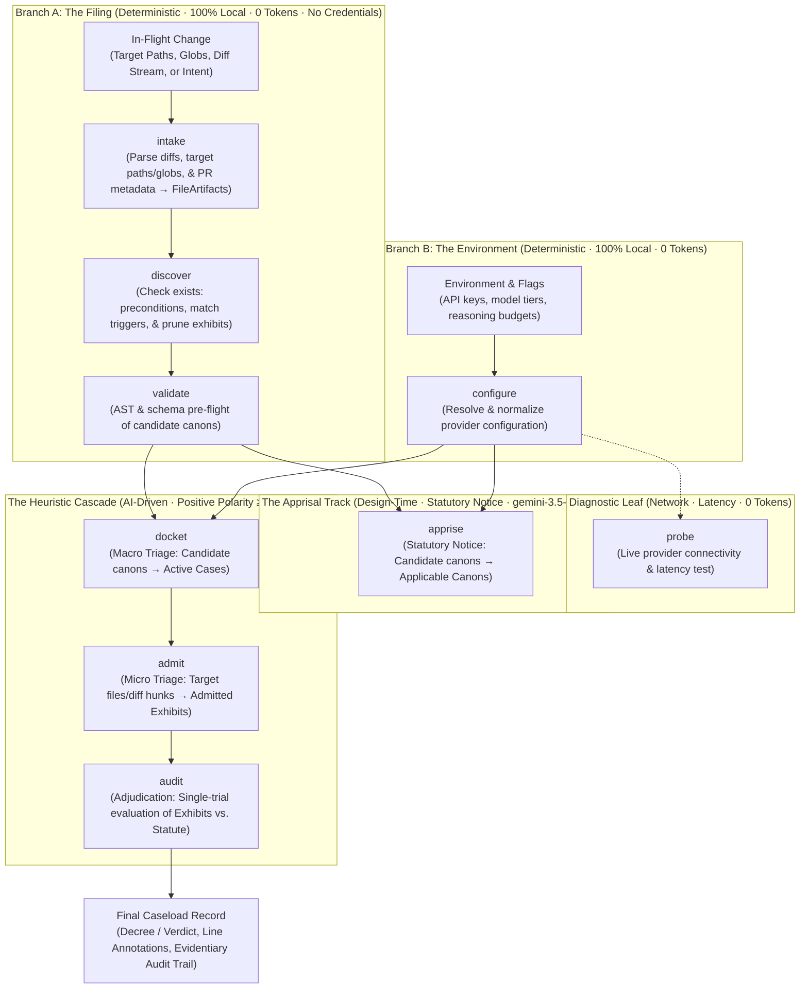
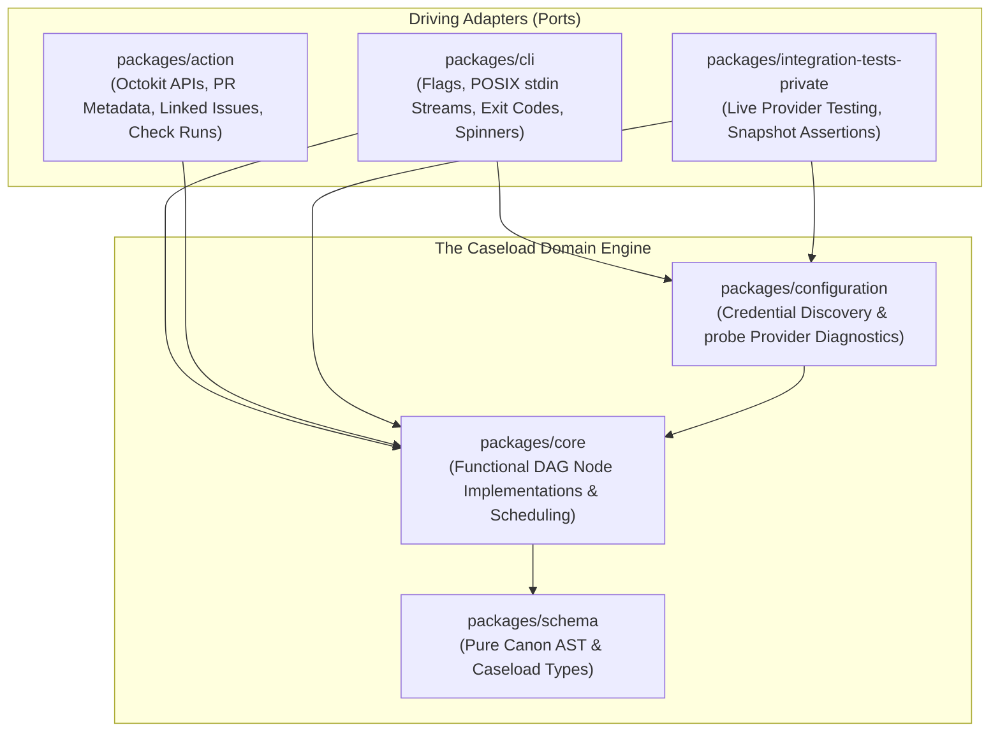
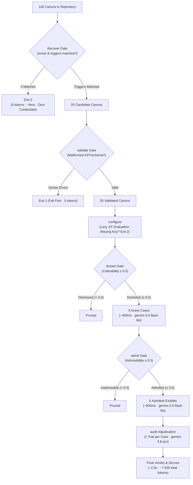

# The Caseload Pipeline: Architecture & Overview

**Status:** Authoritative Architectural Standard  
**Domain Concept:** The Caseload

---

## 1. Executive Summary: The Caseload Paradigm

Every evaluation in Canon Clerk begins with an in-flight change:
- Direct target file arguments (`canon-clerk audit packages/cli/src/app.ts`)
- Directory or file globs (`canon-clerk audit src/`, `canon-clerk audit '**/*.ts'`)
- Positional target paths streamed via stdin (`git diff origin/main --name-only | canon-clerk audit -`)
- A unified diff patch stream (`git diff origin/main | canon-clerk audit --diff -`)
- Pull request metadata (`--pr-title`, `--pr-body`) or structured payloads (`--gh-pr -`)

That in-flight change initiates a **`Caseload`**.

The `Caseload` is the central, cumulative state container flowing through a **Directed Acyclic Graph (DAG)** of functional stages. Rather than a collection of disjoint subcommands producing disparate outputs, Canon Clerk models the entire evaluation as a functional state machine where each stage enriches the shared `Caseload` record.

Subcommands serve as named **terminal stop points** along the DAG, formulated as crisp, single-word **imperative verbs**:

$$
\begin{aligned}
\text{Branch A (Filing Track):}\quad & \text{intake} \longrightarrow \text{discover} \longrightarrow \text{validate} \\
\text{Branch B (Environment Track):}\quad & \text{configure} \quad (\longrightarrow \text{probe}) \\
\text{Adjudication Spine:}\quad & \{\text{validate}, \text{configure}\} \longrightarrow \text{docket} \longrightarrow \text{admit} \longrightarrow \text{audit} \\
\text{Apprisal Track:}\quad & \{\text{validate}, \text{configure}\} \longrightarrow \text{apprise}
\end{aligned}
$$

When invoked, a subcommand executes only the **transitive dependency closure** required for its stage, pruning unneeded branches. Downstream commands fast-forward without re-running upstream stages when supplied an accumulated `Caseload` via `--caseload <path|->`.

---

## 2. DAG Topology: Two Feeder Branches $\to$ Adjudication Spine & Apprisal Track

The DAG consists of **Two Feeder Branches** that converge at `docket` (for dispute adjudication) and `apprise` (for prospective statutory notice), followed by the **Adjudication Spine**, with an auxiliary diagnostic leaf for provider health:

1. **Branch A: The Filing Track (`intake` $\longrightarrow$ `discover` $\longrightarrow$ `validate`):**  
   Ingests in-flight diffs, target paths, or prospective design intent, verifies state preconditions (`exists:`), matches candidate canon triggers, and validates candidate canon ASTs and schemas. Completely local, deterministic, and requires 0 tokens and zero API credentials.
2. **Branch B: The Environment Track (`configure`):**  
   Resolves provider credentials (`GEMINI_API_KEY`), model specifiers, reasoning budgets, and workspace boundaries. Completely offline, deterministic, and completes in <5ms with 0 tokens and zero network calls.
3. **Diagnostic Leaf (`probe`):**  
   An auxiliary termination node depending strictly on `configure`. Executes live provider connectivity and latency tests without triggering an audit run.
4. **The Heuristic Cascade (`docket` $\longrightarrow$ `admit` $\longrightarrow$ `audit`):**  
   Converges at `docket` (requiring both validated candidate canons and active provider configuration), followed by exhibit admissibility screening (`admit`) and single-trial adjudication (`audit`).
5. **The Prospective Apprisal Track (`apprise`):**  
   Converges at `apprise` (requiring validated candidate canons and provider configuration) to evaluate prospective design intent before implementation, completely bypassing diff parsing, `docket`, `admit`, and `audit`.



---

## 3. Hexagonal Architecture: Driving Adapters vs. Core Domain Processing

Canon Clerk strictly abides by **Hexagonal Architecture (Ports & Adapters)** across its workspace packages. The DAG evaluation model is implemented as pure, environment-agnostic domain logic, decoupled from command-line arguments, operating system process boundaries, and continuous integration webhooks.



### The Domain Packages (The Hexagon Core)
- **`@canon-clerk/schema` (`packages/schema`):** Zero runtime dependencies. Defines the canonical TypeScript types for canons, frontmatter, ASTs, and the cumulative `Caseload` state container.
- **`@canon-clerk/core` (`packages/core`):** Depends strictly on `schema`. Houses pure functional implementations of all evaluation stages (`executeIntake`, `executeDiscover`, `executeValidate`, `executeDocket`, `executeAdmit`, `executeAudit`, `executeApprise`), DAG scheduling algorithms, prompt assembly, and trie-constrained decoding schemas. It has no dependencies on CLI flags, stdout formatting, or GitHub Actions.
- **`@canon-clerk/configuration` (`packages/configuration`):** Depends on `core`. Discovers workspace and user settings, resolves API credentials, and implements the diagnostic `probe` provider health check.

### The Driving Adapters (The External Ports)
- **`@canon-clerk/cli` (`packages/cli`):** Driving adapter translating POSIX stdin streams (`-`, `--diff -`, `--caseload -`), argv flags, and local working directories into inputs for `core` and `configuration`. Formats user-facing terminal progress, spinners, and event streams, and maps domain results to shell exit codes (`0`, `1`, `2`).
- **`@canon-clerk/action` (`packages/action`):** Driving adapter translating GitHub Actions workflow triggers, Octokit PR payloads (diffs, commit history, linked issues), and posting results as GitHub Check Runs, step summaries, and inline code annotations ([`action-must-delegate-audit-to-core`](../packages/action/.canons/action-must-delegate-audit-to-core.md)).
- **`@canon-clerk/integration-tests-private` (`packages/integration-tests-private`):** Test driver that feeds real/fixture Caseloads directly into `core` and `configuration` functions against live networked provider services.

---

## 4. The Architectural Triad: Colorability $\to$ Admissibility $\to$ Compliance

Grounding AI evaluation in the cognitive and procedural division of labor of a court clerkship establishes distinct, unambiguous semantics for every heuristic stage:

| Node / Imperative Verb | Core Concept | Metric Pair | Question Answered | Gate / Verdict Threshold |
| :--- | :--- | :--- | :--- | :--- |
| **`apprise`** | **Statutory Apprisal** *(Procedural Notice)* | `apprisalScore`<br/>`apprisalSummary` | *"Given this prospective design intent and target scope, does this canon have a colorable claim of jurisdiction over the planned work?"* | `score >= 0.5` $\implies$ Marked **Applicable** |
| **`docket`** | **Colorability** *(Subject-Matter Jurisdiction)* | `colorabilityScore`<br/>`colorabilitySummary` | *"Does this candidate canon have a colorable claim of jurisdiction over this PR as a whole?"* | `score >= 0.5` $\implies$ Opened as an **Active Case** |
| **`admit`** | **Admissibility** *(Relevance of Evidence)* | `admissibilityScore`<br/>`admissibilitySummary` | *"For an active Case, is this specific file/diff hunk admissible as relevant evidence?"* | `score >= 0.5` $\implies$ Admitted as an **Exhibit** |
| **`audit`** | **Compliance** *(Substantive Merits)* | `complianceScore`<br/>`complianceSummary` | *"Given the admitted exhibits and governing invariant/exceptions, does the change comply with canon statute?"* | `score >= 0.5` $\implies$ **Compliant** (`pass`) 🟢<br/>`score < 0.5` $\implies$ **Violation** (`fail`) 🔴 |

### The Court Clerkship Taxonomy
- **The Caseload:** The cumulative lifecycle container for the evaluation run.
- **Statutory Apprisal (`apprise`):** Procedural notice issued by the clerk apprising parties of governing statutes pertaining to prospective design intent before implementation begins.
- **Candidate Canons:** Rules whose declared `exists:` state preconditions match the Target File Tree, and whose `triggers:` or `inspect:` planes match in-flight exhibits during `discover` (subject to monorepo Scope Containment).
- **Cases:** Canons that pass macro triage during `docket` and enter the Active Docket.
- **Exhibits (The Unified Evidence Lifecycle):**
  - **Tendered Exhibits (`intake`):** Raw filing inputs, including literal text metadata (`pr_title`, `pr_body`, `commit_messages`, `linked_issues`), diff streams (`diff`), prospective design intent (`--intent`), and target file discovery directives.
  - **Candidate Exhibits (`discover`):** Materialized exhibits retained after mutual pruning with candidate canons (dropping un-inspected exhibits to preserve token hygiene).
  - **Admitted Exhibits (`admit`):** Exhibits formally admitted as relevant evidence for a specific Case on the docket (`admissibilityScore >= 0.5`).
- **Trial / Decree:** The isolated prompt turn and final adjudication rendered during `audit` per Case against its admitted exhibits.

### Positive Polarity Consistency
All heuristic metrics share an identical polarity convention: **a higher score reflects the affirmative presence of the named property**:
- **`apprise` (High Apprisal):** Affirmative jurisdiction $\implies$ canon marked applicable (`score >= 0.5`).
- **`docket` (High Colorability):** Affirmative jurisdiction $\implies$ canon opened as an active Case.
- **`admit` (High Admissibility):** Affirmative relevance $\implies$ file/hunk admitted as an Exhibit for that Case.
- **`audit` (High Compliance):** Affirmative adherence $\implies$ change complies with canon statute and passes review (`score >= 0.5`).

---

## 5. The Caseload Pipeline Nodes

| Node / Verb | Track | Engine / Tier | Cost / Latency | Gate Rule |
| :--- | :--- | :--- | :--- | :--- |
| `intake` | Branch A (Filing) | Deterministic | 0 tokens, ~5ms | Parsed context; fail fast (code 2) on corrupted input |
| `discover` | Branch A (Filing) | Deterministic | 0 tokens, ~8ms | Matches > 0; verifies `exists:` & `triggers:`; short-circuits (exit 0) on 0 candidates |
| `validate` | Branch A (Filing) | Deterministic | 0 tokens, ~12ms | 0 syntax errors; fails fast (code 1) on lint error |
| `configure` | Branch B (Env) | Deterministic | 0 tokens, <5ms | Valid config; fails fast (code 2) on missing keys |
| `probe` | Diagnostic Leaf | Network probe | 0 tokens, variable | Endpoint reachable; fails fast (code 2) on failure |
| `apprise` | Apprisal Track | Flash-Lite AI | ~400ms, low $ | `apprisalScore >= 0.5`; exits 0 if candidates empty |
| `docket` | Cascade Spine | Flash-Lite AI | ~400ms, low $ | `colorabilityScore >= 0.5`; exits 0 if docket empty |
| `admit` | Cascade Spine | Flash-Lite AI | ~600ms, low $ | `admissibilityScore >= 0.5`; exits 0 if no exhibits |
| `audit` | Cascade Spine | Pro Reasoning | ~2.5s, targeted | `complianceScore >= 0.5` $\implies$ pass (0), else fail (1) |

---

## 6. The Token & Latency Sieve

The Caseload Pipeline functions as an aggressive filter funnel, eliminating the overwhelming majority of candidate pairs before invoking deep reasoning:



| Pipeline Step | Canons / Cases in Flight | Target Exhibits | Model Tier | Token Cost | Latency |
| :--- | :--- | :--- | :--- | :--- | :--- |
| **Initial Workspace** | 100 canons | All repo files | Local AST / Globs | 0 tokens | ~25ms |
| **`discover` Gate** | 20 candidates | 6 touched files | Local Regex / Globs | 0 tokens | ~8ms |
| **`docket` Gate** | 3 active Cases | 6 touched files | `gemini-3.5-flash-lite` | ~1,200 tokens | ~420ms |
| **`admit` Gate** | 3 active Cases | 5 admitted hunks | `gemini-3.5-flash-lite` | ~1,800 tokens | ~610ms |
| **`audit` Adjudication** | 3 trials | 5 exhibits | `gemini-3.8-pro` | ~4,500 tokens | ~2,400ms |
| **Total Funnel** | **3 evaluated** | **5 exhibits** | **Cascade Sieve** | **~7,500 tokens** | **< 3.5s** |

*(Versus naive evaluation: 100 canons × 6 files = 600 pairs $\approx$ 220,000 tokens and 45s latency. **~97% token reduction**).*

---

## 7. The Cumulative `Caseload` State Container

The `Caseload` is the central, immutable data envelope flowing through the pipeline. Rather than passing disjoint arguments between commands, each stage reads accumulated upstream state and enriches its own dedicated namespace on the shared `Caseload` object.

The formal TypeScript types are maintained in `@canon-clerk/schema` ([`packages/schema`](../../packages/schema) and [`openspec/specs/schema/spec.md`](../../openspec/specs/schema/spec.md)), and granular payload schemas are specified in each node's architectural document.

### The Top-Level `Caseload` Envelope

```ts
export interface Caseload {
  /** Schema specification version */
  readonly version: '1.0';

  /** Intake: Change diffs (FileArtifacts), target paths, prospective intent, or PR metadata */
  readonly intake?: CaseloadIntake | undefined;

  /** Discovery: Matched target paths, candidate canons, and trigger intersections */
  readonly discovery?: CaseloadDiscovery | undefined;

  /** Validation: Candidate canons syntax and frontmatter AST validation results */
  readonly validation?: CaseloadValidation | undefined;

  /** Configuration: Resolved workspace paths, provider credentials, and model specifiers */
  readonly config?: CaseloadConfig | undefined;

  /** Probe (Diagnostic Leaf): Live provider connectivity and latency test results */
  readonly probe?: CaseloadProbe | undefined;

  /** Apprisal (Statutory Notice): Prospective applicability assessments against design intent */
  readonly apprisal?: CaseloadApprisal | undefined;

  /** Docket (Macro Triage): Colorability assessments and active cases admitted to docket */
  readonly docket?: CaseloadDocket | undefined;

  /** Evidence (Micro Triage): Admitted exhibits and relevance scores per active case */
  readonly evidence?: CaseloadEvidence | undefined;

  /** Verdict (Adjudication): Substantive compliance decrees and line annotations */
  readonly verdict?: CaseloadVerdict | undefined;
}
```

### Stage Payloads & Authoritative Specifications

Each pipeline stage owns a dedicated, non-overlapping field on the cumulative `Caseload`:

| Field on `Caseload` | Enriched By | Track | Payload Summary | Authoritative Specification |
| :--- | :--- | :--- | :--- | :--- |
| `.intake` | `intake` | Branch A (Filing) | Tendered exhibits: diff hunks, target paths, PR metadata, or intent queries | [`nodes/intake.md`](nodes/intake.md#caseload-delta) |
| `.discovery` | `discover` | Branch A (Filing) | Candidate canons matching path triggers & target file intersections | [`nodes/discover.md`](nodes/discover.md#caseload-delta) |
| `.validation` | `validate` | Branch A (Filing) | Deterministic AST linting and frontmatter schema validation results | [`nodes/validate.md`](nodes/validate.md#caseload-delta) |
| `.config` | `configure` | Branch B (Env) | Workspace root, resolved screener/auditor model specifiers, reasoning budget | [`nodes/configure.md`](nodes/configure.md#caseload-delta) |
| `.probe` | `probe` | Diagnostic Leaf | Live endpoint reachability, roundtrip latency (ms), and resolved models | [`nodes/probe.md`](nodes/probe.md#caseload-delta) |
| `.apprisal` | `apprise` | Apprisal Track | Prospective statutory jurisdiction assessments (`apprisalScore`, `apprisalSummary`) | [`nodes/apprise.md`](nodes/apprise.md#caseload-delta) |
| `.docket` | `docket` | Dispute Spine | Macro triage colorability assessments and list of opened active cases | [`nodes/docket.md`](nodes/docket.md#caseload-delta) |
| `.evidence` | `admit` | Dispute Spine | Micro triage evidence admissibility: admitted file exhibits per active case | [`nodes/admit.md`](nodes/admit.md#caseload-delta) |
| `.verdict` | `audit` | Dispute Spine | Final substantive adjudications, compliance scores, decrees, and line annotations | [`nodes/audit.md`](nodes/audit.md#caseload-delta) |

Downstream subcommands fast-forward across any stage whose corresponding namespace is already populated on an incoming `Caseload` (via `--caseload <path|->`).

---

## 8. Observability & The Telemetry Event Stream

Canon Clerk strictly separates **substantive evaluation records** from **operational execution telemetry**:

- **Substantive Record (`Caseload`):** Represents solely substantive findings. Identical inputs evaluated at temperature 0 produce bit-for-bit identical `caseload.json` files, enabling clean git diffs, content-addressable cache keys, and regression snapshot tests.
- **Event Logging (`stderr` / `--log-file`):** Operational metrics (wall-clock milliseconds, token usage, time-to-first-token/thought) and streaming intermediate chunks (thought deltas) are emitted via an **Event Stream**:

```ts
export type CaseloadEvent =
  | { type: 'stage:start'; stage: PipelineStage; timestamp: string }
  | { type: 'thought'; stage: PipelineStage; delta: string }
  | { type: 'stage:finish'; stage: PipelineStage; durationMs: number; usage?: ModelUsage }
  | { type: 'pipeline:finish'; totalDurationMs: number; totalTokens?: ModelUsage };
```

Interactive CLI runs format this stream to `stderr` for spinners and terminal progress indicators, while automated CI pipelines capture it in workflow logs or write it via `--log-file <path>`.
