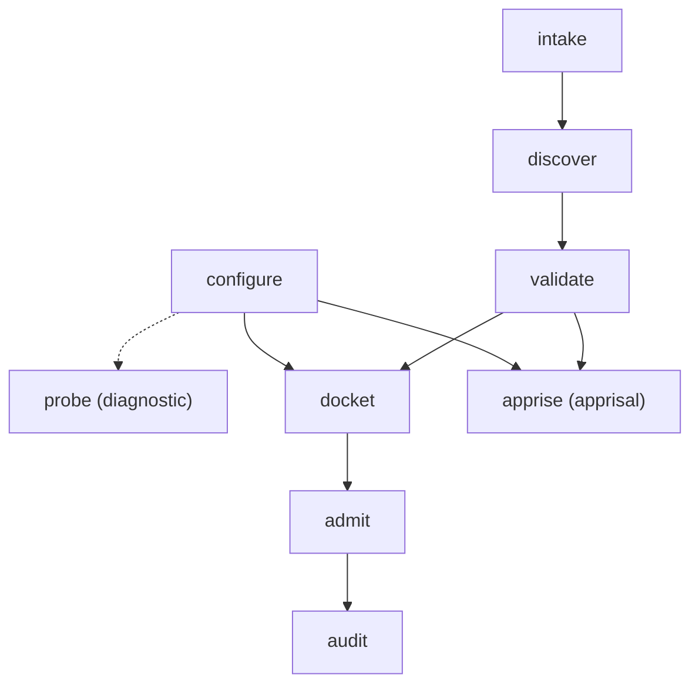
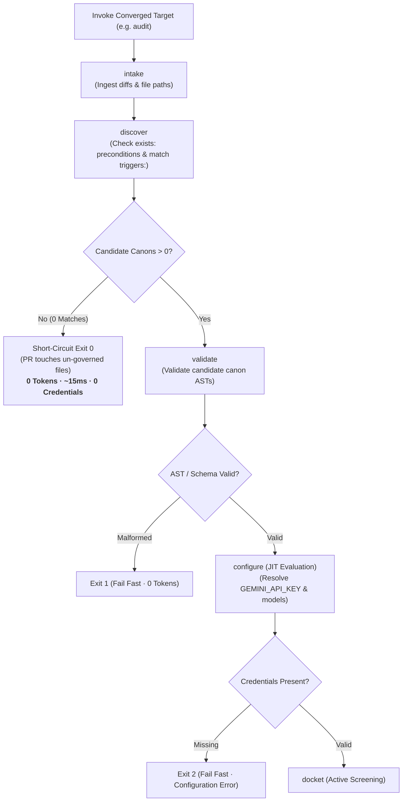

# DAG Scheduling & Execution Semantics

**Status:** Authoritative Architectural Standard  
**Domain Concept:** Dependency Closure Calculation & Scheduling

---

## 1. Executive Summary

Canon Clerk's subcommands and action entry points represent **terminal stop points** along a Directed Acyclic Graph (DAG) with an auxiliary diagnostic leaf. 

Under Canon Clerk's Hexagonal Architecture, **DAG scheduling and execution semantics are implemented as pure domain services within `@canon-clerk/core`**. Both the CLI (`@canon-clerk/cli`) and the GitHub Action (`@canon-clerk/action`) delegate to this engine service, ensuring identical closure calculation, pruning, and lazy scheduling behavior regardless of whether an audit is initiated from a local terminal or a remote GitHub Actions runner.

Instead of running a monolithic pipeline that redundantly requires network connectivity and API keys for purely local operations, the scheduler calculates the **transitive dependency closure** for the requested terminus node and prunes unneeded branches.

---

## 2. Transitive Dependency Closures & Pruning

The full DAG consists of:
- **Branch A (The Filing Track):** `intake` $\longrightarrow$ `discover` $\longrightarrow$ `validate`
- **Branch B (The Environment Track):** `configure`
- **Diagnostic Leaf:** `probe` (depends strictly on `configure`)
- **Dual Track Convergence:**
  - **The Contentious Track (Adjudication of In-Flight Changes):** `docket` $\longrightarrow$ `admit` $\longrightarrow$ `audit`
  - **The Apprisal Track (Prospective Jurisprudence):** `apprise` (evaluates prospective design intent against candidate canons, bypassing `docket`)



### Dependency Closure Calculation
When an operator or CI workflow executes a subcommand $T$, the runner constructs the minimal ancestor subgraph $\text{Closure}(T)$ required to evaluate $T$:

| Terminus Node ($T$) | Transitive Dependency Closure $\text{Closure}(T)$ | Pruned Branches & Nodes |
| :--- | :--- | :--- |
| `intake` | $\{\text{intake}\}$ | Branch B (`configure`), `probe`, downstream nodes (`discover`, `validate`, `docket`, `admit`, `audit`, `apprise`) |
| `discover` | $\{\text{intake}, \text{discover}\}$ | Branch B (`configure`), `probe`, downstream nodes (`validate`, `docket`, `admit`, `audit`, `apprise`) |
| `validate` | $\{\text{intake}, \text{discover}, \text{validate}\}$ | Branch B (`configure`), `probe`, downstream nodes (`docket`, `admit`, `audit`, `apprise`) |
| `configure` | $\{\text{configure}\}$ | Branch A (`intake`, `discover`, `validate`), `probe`, adjudication/apprisal spines (`docket`, `admit`, `audit`, `apprise`) |
| `probe` | $\{\text{configure}, \text{probe}\}$ | Branch A (`intake`, `discover`, `validate`), adjudication/apprisal spines (`docket`, `admit`, `audit`, `apprise`) |
| `docket` | $\{\text{intake}, \text{discover}, \text{validate}, \text{configure}, \text{docket}\}$ | `probe`, `apprise`, downstream adjudication nodes (`admit`, `audit`) |
| `admit` | $\{\text{intake}, \text{discover}, \text{validate}, \text{configure}, \text{docket}, \text{admit}\}$ | `probe`, `apprise`, `audit` |
| `audit` | $\{\text{intake}, \text{discover}, \text{validate}, \text{configure}, \text{docket}, \text{admit}, \text{audit}\}$ | `probe`, `apprise` |
| `apprise` | $\{\text{intake}, \text{discover}, \text{validate}, \text{configure}, \text{apprise}\}$ | `probe`, contentious adjudication spine (`docket`, `admit`, `audit`) |

### Transitive Closure Pruning Rules
1. **Branch A Independence:** `configure` and `probe` execute with zero knowledge of Git diffs, modified files, or repository canons.
2. **Branch B Independence:** `intake`, `discover`, and `validate` execute with zero knowledge of AI providers, model configurations, or API credentials.
3. **Diagnostic Isolation:** `probe` is never scheduled during review cascades (`docket`, `admit`, `audit`), eliminating unnecessary health-check latency prior to screening.
4. **Plenary Corpus Validation (`--all-canons`):** When `validate` is invoked with `--all-canons`, Branch A executes with full corpus scope: `intake` establishes plenary scope, `discover` promotes all discoverable workspace canons to `candidateCanons`, and `validate` verifies the entire statutory corpus without requiring diffs or code changes.

---

## 3. The Guarded / Lazy Scheduling Invariant

When executing toward a converged target (`docket`, `admit`, `audit`), both Branch A (`validate`) and Branch B (`configure`) are required ancestors. However, running `configure` unconditionally at startup would break a critical engineering invariant: **PRs touching un-governed files must pass in CI without requiring API credentials or external secret provisioning.**

To uphold this guarantee, the scheduler enforces the **Guarded / Lazy Scheduling Invariant**:



### Sequential Invariant Guarantees:
1. **`intake` and `discover` execute first.** If zero candidate canons match the modified paths and state preconditions, Canon Clerk immediately logs `0 candidate canons matched` and exits with code `0`.
2. **Branch B (`configure`) is never evaluated if candidates count is zero.** Fork pull requests, documentation updates, and changes to un-governed directories succeed in ~15ms without a configured `GEMINI_API_KEY`.
3. **`validate` evaluates candidate syntax before credentials are checked.** If a canon contains YAML or markdown errors, the runner fails fast with exit code `1` before loading provider credentials.
4. **`configure` resolves JIT** only when valid candidate canons exist and heuristic screening is imminent.

---

## 4. Execution Ergonomics: Telescoping vs. Unix Pipelining

Canon Clerk provides two ergonomic execution patterns:

### Pattern A: Telescoping Backfill Mode (Default Interactive & CI)
When a developer or CI job invokes a downstream terminus naked:
```bash
git diff origin/main | canon-clerk audit --diff -
```
The runner:
1. Initializes a blank `Caseload`.
2. Resolves the transitive closure for `audit`: `[intake, discover, validate, configure, docket, admit, audit]`.
3. Executes each node in-memory sequentially according to the guarded scheduling invariant.
4. Returns the final verdict and exit code.

### Pattern B: Composable Unix Pipelining (`--caseload <path|->`)
For distributed build systems, caching servers, or debugging sessions, every subcommand accepts an existing `Caseload` record via `--caseload <path|->` and emits the updated Caseload via `--json`:

```bash
# 1. Deterministic Filing Track on developer machine (offline, no keys):
git diff origin/main | canon-clerk intake --diff - --json > caseload-1.json
canon-clerk discover --caseload caseload-1.json --json > caseload-2.json
canon-clerk validate --caseload caseload-2.json --json > caseload-3.json

# 2. Heuristic Adjudication in CI worker (with GEMINI_API_KEY):
canon-clerk configure --caseload caseload-3.json --json > caseload-4.json
canon-clerk docket --caseload caseload-4.json --json > caseload-5.json
canon-clerk admit --caseload caseload-5.json --json > caseload-6.json
canon-clerk audit --caseload caseload-6.json
```

---

## 5. Static Schedule Lookup Table

The scheduler determines the node sequence using a deterministic static table. For any terminus command, the runner evaluates nodes in the listed order, **fast-forwarding past any node whose corresponding section is already populated** on the incoming `Caseload`:

| Command Terminus | Guarded Execution Sequence | Fast-Forward Skip Property |
| :--- | :--- | :--- |
| `canon-clerk intake` | `[intake]` | Skips `intake` if `caseload.intake` present |
| `canon-clerk discover` | `[intake, discover]` | Skips `intake` if `caseload.intake` present;<br>Skips `discover` if `caseload.discovery` present |
| `canon-clerk validate` | `[intake, discover, validate]` | Skips `intake` if `caseload.intake` present;<br>Skips `discover` if `caseload.discovery` present;<br>Skips `validate` if `caseload.validation` present |
| `canon-clerk configure` | `[configure]` | Skips `configure` if `caseload.config` present |
| `canon-clerk probe` | `[configure, probe]` | Skips `configure` if `caseload.config` present;<br>Skips `probe` if `caseload.probe` present |
| `canon-clerk docket` | `[intake, discover, validate, configure, docket]` | Skips any node whose corresponding field (`.intake`, `.discovery`, `.validation`, `.config`, `.docket`) is already present |
| `canon-clerk admit` | `[intake, discover, validate, configure, docket, admit]` | Skips any node whose corresponding field is already populated |
| `canon-clerk audit` | `[intake, discover, validate, configure, docket, admit, audit]` | Skips any node whose corresponding field is already populated |
| `canon-clerk apprise` | `[intake, discover, validate, configure, apprise]` | Skips any node whose corresponding field (`.intake`, `.discovery`, `.validation`, `.config`, `.apprisal`) is already present |

### Missing Input Source Guard vs. Empty Stream Short-Circuit
The scheduler and CLI enforce strict input handling to distinguish operator error from legitimate no-ops:

1. **Missing Source Guard (Naked Invocation $\implies$ Exit 2):**  
   When a subcommand requiring filing context or explicit scope (`intake`, `discover`, `validate`, `docket`, `admit`, `audit`, `apprise`) is invoked without file arguments, diff flags (`--diff`), intent flags (`--intent`), stream tokens (`-`), an incoming `--caseload`, or an explicit scope flag (`--all-canons`, `--all-targets`), execution immediately terminates with **exit code 2** (Usage Error) and prints actionable guidance. The CLI never silently hangs waiting for input on a TTY.

2. **Empty Stream Short-Circuit (Legitimate No-op $\implies$ Exit 0):**  
   When an operator explicitly designates an input source (e.g. `git diff origin/main | canon-clerk audit --diff -`) and that source produces zero changes:
   - `intake` records an empty filing (`diffs: {}`, `targetPaths: []`).
   - `discover` intersects with empty target paths $\implies$ `candidateCanons: []`.
   - The runner logs `0 modified files; 0 candidate canons matched` and short-circuits cleanly with **exit code 0**.

3. **The Case or Controversy Invariant:**  
   The heuristic adjudication spine (`docket`, `admit`, `audit`) evaluates the application of canons *as applied to a concrete change*. While statutory linting can operate in the abstract (`validate --all-canons`), running adjudication on a null intake (e.g. `canon-clerk docket --all-canons` without target files) is rejected with **exit code 2**: a court cannot open an active docket or hold a trial without an underlying complaint or controversy. In contrast, the prospective apprisal spine (`apprise`) operates under **Statutory Apprisal Authority**, taking prospective design intent queries and prospective file paths to determine governing statutes.

### Short-Circuit Fast Exit Conditions
Across the pipeline, five deterministic short-circuit conditions trigger early termination:
1. **At `discover`:** If `candidateCanons.length === 0` $\implies$ Exit `0` immediately (`intake` and `discovery` attached to emitted Caseload; downstream nodes skipped).
2. **At `validate`:** If `validation.hasErrors === true` $\implies$ Exit `1` immediately (malformed canon syntax; zero tokens spent).
3. **At `docket`:** If `activeDocket.length === 0` $\implies$ Exit `0` immediately (all candidate canons dismissed at macro screening; zero trials scheduled).
4. **At `admit`:** If all active cases retain zero admitted exhibits $\implies$ Exit `0` immediately (no admissible evidence; zero trials scheduled).
5. **At `apprise`:** If `candidateCanons.length === 0` $\implies$ Exit `0` immediately (all candidate canons dismissed at discovery; empty apprisal brief attached to emitted Caseload).
